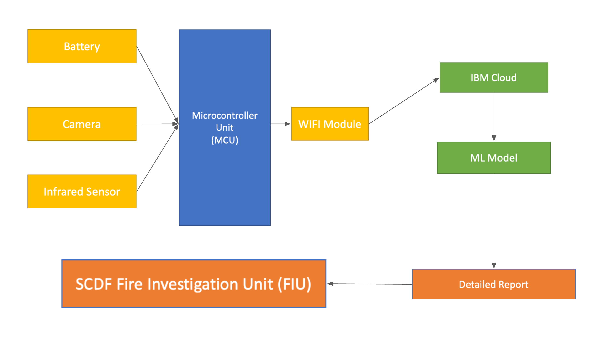

Verbatim
========

We are Surendra and Rohit (NUS), Pradeep and Pramath (UCB), and Anthony (NYU) from team PRASP.

## a) Short Description of Problem & Solution

To Protect and Save Lives and Property. Perhaps no other action describes SCDF’s mission as clearly as fighting fires. However, the current firefighting process is inefficient, especially in the post-fire process. Fire reports can be incredibly tiring, expensive, time-consuming and long-winded for FIU teams and we believe technology can be used to solve this problem.

We present Verbatim, a device that can be attached to a firefighter’s helmet that will track the firefighting process and the surroundings with cameras and sensors. It then uses Computer Vision and Natural Language Processing to quickly and accurately describe the scene verbatim to commanders or FIU teams afterwards. This device will be powered by a solar charging unit and leverage other green tech to be environmentally friendly by design.

## b) Pitch Video

https://youtu.be/NdsHEcdcLok

## c) Architecture



### Hardware

Devices used in this project can be split into two main parts. Firstly, we have the Verbatim Sensor (helmet attachment) which consists of the microcontroller, battery, size adjustment band, camera, and infrared sensor. This device is responsible for recording and uploading the video feed and infrared data from the firefighter's point of view during the operation.

Based on our conversation with some of our friends who served in the SCDF, drying their PPE under the sun after use is a common practice. As such, we felt that solar energy would be an appropriate renewable source of energy to tap on in order to power our device. We thus have the Verbatim Sensors’ solar charging unit, which consists of the solar panel and the solar charge controller.

The following images provide an overview of the Verbatim Sensor and Solar Charging Unit:


For a more detailed description of hardware and design choices, please refer to our [detailed solution](https://drive.google.com/file/d/1GO00JuoyjCBW_GPh0gss03R0bGx-KMYq/).

### Software

The following diagram highlights the end-to-end system that we have built: 


This model architecture draws inspiration from the [Show and Tell paper by Vinyals et al](https://arxiv.org/abs/1411.4555v2). Given a video input, the model is able to understand the scene and generate a report containing a detailed description of the scene. OpenCV is used to process the video into frames. These frames are passed to a [pretrained ResNet-50](https://arxiv.org/abs/1512.03385v1), trained on the ImageNet dataset, to obtain a feature map. These feature maps are passed through a fully connected layer to obtain a vector representation of the image. The vector is passed to a K-Nearest Neighbour (KNN) algorithm which uses Cosine Similarity to compare feature vectors of two consecutive frames to determine dissimilarity. If they are above a dissimilarity threshold, the feature vector is deemed as different from the previous one and is added into a pool of dissimilar feature vectors. These vectors are passed into the first time step of the [Long Short Term Memory (LSTM) network](https://doi.org/10.1162/neco.1997.9.8.1735). 

The LSTM network was trained by us on publicly available images and the Flickr30k dataset. An embedding layer was used to embed the captions into vectors using pre-trained [GloVe: Global Vectors for Word Representation](https://nlp.stanford.edu/projects/glove/) word embeddings with 6B tokens and 300 dimensions. For training, Cross Entropy Loss was used with Adam optimizer. The model predicts Start of sentence token (\<SOS>), End of Sentence token (\<EOS>), words in between and the Unknown token (\<UNK>) if it encounters a word not in its vocabulary. All sentences generated are collated into a report as the final output.


## d) Detailed Solution

https://drive.google.com/file/d/1GO00JuoyjCBW_GPh0gss03R0bGx-KMYq/

## e) Roadmap


## f) Quick Start Guide

### Hardware

#### Controls
The button to control the Verbatim Sensor can be found at the side of the battery module. 

| Click Frequency  | State (On / Off) | Action                                              |
|:----------------:|:----------------:|:---------------------------------------------------:|
|       1          |        off       | Turn on and start recording                         |
|       2          |        off       |   Connect to wifi and sync local data to IBM cloud  |
|       1          |        on        |    Stop recording and turn off                      |


#### Setup 
Connection to the respective HQ wifi to be done prior to the operation.

#### Usage

##### Pre-Operation
Firefighter will attach the component to the helmet, and use the adjustment band to fit it properly.

##### Operation
Turn on the Verbatim Sensor and a red light will appear indicating that the recording has begun. 

##### Post-Operation
The recording can be stopped by pressing the same button at the side of the battery. When the IoT device is in an area where there is wifi (likely in HQ/base), press the button at the side of the battery twice. The device will connect to wifi and sync data to IBM Cloud. 


### Software

#### AI Model

Here are the following steps to quickly run the AI model on a sample video or images.
1. Libraries required: Pytorch, Spacy, OpenCV, Numpy
2. Clone the repository onto your local machine
3. Navigate to the AI Model directory
4. Head to [this link](https://drive.google.com/drive/folders/1qAMsgAvIeC-arU5z1E75jnE0g6D5zKe0) and download `glove_6B_300d/glove.6B.300d.txt` (embedding_file) and `saved_model/captioner_resnet50_h1024_glove_300dim.pth.tar` (pretrained_model)
5. Run the following command on your terminal:

```    
python inference.py -a annotation_file -e embedding_file -ml pretrained_model -v video_path   
```
- `-a` : annotation_file (required)  
- `-e` : embedding_file (required) 
- `-ml` : pretrained_model (required)  
- `-v` : video_path (either video path or image_path required)  
- `-im` : image_path (either video path or image_path required)  
- `-th` : threshold (optional, any value between 0 to 1)  

Here are the following steps to train the AI model on your machine.  
1. Libraries required: Pytorch, Spacy, OpenCV, Numpy  
2. Clone the repository onto your local machine  
3. Navigate to the AI Model directory
4. If you are using our pretrained model, head to [this link](https://drive.google.com/drive/folders/1qAMsgAvIeC-arU5z1E75jnE0g6D5zKe0) and copy the `saved_model` folder into this directory
5. Run the following command on your terminal:

```    
python train.py -t training_folder_path -v validation_folder_path -ml pretrained_model
```    
- `-t` : training_folder_path (training dataset, required)  
- `-v` : validation_folder_path (test/validation dataset, required)  
- `-ml` : pretrained_model (only needed for finetune training, optional)   

#### Frontend


On the left column, users can choose the specific incident they want to investigate. Generated reports and their matched videos from the perspective of each firefighter who attended to the incident will be viewable on our front end dashboard. Users have the option to either download individual files or all files of the incident at once.

## h) Live demo

https://verbatim.vercel.app 


## i) Tech Stack
1. React
2. ML Libraries
    - OpenCV
    - PyTorch
    - SpacCy
    - NumPy
3. Autodesk Inventor
4. IBM Cloud
